<div align="center">

# 某全网百万粉丝博主情感分析技术流

**1秒判断还要不要继续。不是鸡汤，直接给判决。**

问你的AI："我同事小A约不出来，还要继续吗？"
→ 精准分析 + 3个方案 + 终局判决：继续、到此为止、撤。

[看效果](#效果示例) · [装上](#安装) · [它强在哪](#它强在哪) · [怎么用](#怎么用)

---



---


</div>

---

## 效果示例

### "她对我时好时坏，什么意思？"

> **用户**：我和一个女生聊了5天，她每次都回，但从来不主动找我。会发表情包，也会问"你呢"，但从来不追问。她对我有意思吗？

**AI**：

**黄灯区。** 不是没兴趣，但兴趣不够。

| 信号 | 判断 | 档位 |
|------|------|------|
| 每次都回 | 有礼貌，但不等于兴趣 | 🟡 |
| 会问"你呢" | 有互动，但属于被动回应 | 🟡 |
| 从不主动找你 | 有兴趣的人会找机会联系你 | 🔴 |
| 从不追问 | 只是在回应你，没有想了解你的欲望 | 🔴 |

**结论**：你大概率是备选位。

**下一步**：停止每天主动找她，空1-2天。2天没找你 → 确认备选位。

**终局判决**：先观察，别再加大投入。

---

### "约她她说再看吧"

> **用户**：聊了两周，约她周末吃饭，她说"再看吧最近有点忙"。

**AI**：

**软拒。** 但软拒不等于没戏，看你怎么接。

**绝对不要**：
- ❌ "那下周呢？" — 连续邀约 = 需求感暴露
- ❌ "你什么时候有空？" — 把决定权交给她 = 低价值

**正确处理**：
> "行，你先忙你的，等你闲了再说 👋"

这句话做了三件事：展示你不缺她 / 把球踢回给她 / 不卑不亢。

**终局判决**：先收线，看她反应。追出来的约会没意义。

---

### "她是不是捞女？"

> **用户**：7分做直播的，第一次见面就暗示我送她包。但平时会主动找我聊天，会关心我。真心还是捞？

**AI**：

**四档对照**：

| 类型 | 匹配度 | 风险 |
|------|--------|------|
| 底层挣扎者 | ❌ 7分做直播不是底层 | 低 |
| 主流大众 | ⚠️ 要礼物但有情绪互动 | 中 |
| 顶级职业玩家 | ⚠️ 7分+直播+第一次就要包 | 🔴 高 |

**测试**：温和拒绝（"包太贵了，请你吃顿好的倒没问题"），看反应：
- 生气/冷淡/不回 → 职业玩家，**撤**
- 说"好吧"继续聊 → 主流大众，控制付出节奏
- 说"不用了"然后主动约你 → 绿灯

**终局判决**：先测试再决定。测试结果决定继续还是撤。

---

### "我还要不要继续？"

> **用户**：追了3个月，送了两次礼物（2000多），她收了但从来没主动找过我。约出来过一次，吃完就走了。我月薪8000，她5.5分做微商。

**AI**：

**撤。**

1. 3个月0主动联系 → 你是资源位，不是备选
2. 收礼物但不见面 → 你被当提款机了
3. 月薪8000投2000追5.5分 → ROI严重失衡
4. 3个月只约出1次 → 正常进度2-3周就该约出来

**终局判决**：别投资了，再投全是沉没成本。回去补形象和资源池，下次打匹配的局。

---

### "信息不够会怎样？"

> **用户**：我和一个女生聊了一段时间，不知道要不要继续

**AI**：

信息不够，先回答3个问题：

1️⃣ **她什么类型？**（职业？朋友圈风格？颜值几分？）
2️⃣ **什么阶段？**（加微多久？见过面？多久没聊？）
3️⃣ **你的情况？**（月薪？形象？城市？）

---

> **用户补充**：6分白领，朋友圈美食+自拍，加微2周没约出来，她有时主动找我，约她总说忙。月薪1万，形象5分，成都。

**AI**：

**核心卡点**：邀约被拒。不是没兴趣，是当量不够。

2周文字聊天 ≈ 1次语音，还没到能约出来的当量。

**下一步**：
1. 停止邀约，先累当量（"打字太累了，语音说？"）
2. 1次1小时语音 ≈ 3天文字聊天，2次语音后再邀约
3. 邀约给具体方案："周六下午太古里那家新开的咖啡店"

**终局判决**：继续，但换打法。别再干约了，先累当量再出手。

---

## 它强在哪

### 话术层面

| 能力 | 通用AI | 本项目 |
|------|--------|--------|
| 开场聊天 | "你好，很高兴认识你" | 5种开场策略，按她类型自动匹配 |
| 兴趣判断 | "她可能对你有意思" | 信号灯 + 24个IOI指标，红黄绿明确判断 |
| 邀约被拒 | "过几天再试试" | 收线版话术 + 高价值离场 |
| 女性类型 | "每个人都是独特的" | 4大类型 + 捞女4档 + 顶美4象限 |
| 止损判断 | "再坚持一下，也许她会改变" | 五步分析法 → 明确判决 |
| 多人追踪 | 小A的事套到小B身上 | 自动追踪表，绝不串人 |

### 技术层面

| 能力 | 通用AI | 本项目 |
|------|--------|--------|
| 知识来源 | 通用训练数据 | 44条专项规则，1000+小时实战 |
| 建议一致性 | 今天让你真诚，明天让你保持神秘 | 44条规则贯穿，逻辑统一 |
| 回答结构 | 想到哪说到哪 | 五步分析法：识人→识场→识己→定方案→定生死 |
| 终局判决 | "也许""可能""看情况" | **"继续""到此为止""撤"** — 三选一 |
| 信息不足时 | 硬给笼统建议 | 追问3个关键问题，问完再给精准建议 |

---

## 安装

**3步，装上就能用：**

```
1️⃣ 下载    → 从本仓库下载 public-skill.md
2️⃣ 安装    → 放入你AI助手的skill目录
3️⃣ 提问    → 直接用中文提问
```

| AI助手 | 安装方式 |
|--------|---------|
| Trae IDE | `.trae/skills/` 目录 |
| Cursor | `.cursor/skills/` 目录 |
| Claude Desktop | 配置文件中指定skill路径 |
| 其他 | 放入对应skill目录 |

**验证安装**：问你的AI "你是某全网百万粉丝博主情感分析技术流吗？"

✅ 提到"五步分析法"或"44条规则" → 装好了
❌ 只说"我是Claude/ChatGPT" → 检查文件位置和文件名

---

## 怎么用

### 提问方式

**好的提问**（信息充分）：
> 我同事小A，6分，做行政的，会主动找我聊，但约她吃饭她说再看吧。我月薪1.2万，杭州，形象一般。怎么推进？

**差的提问**（信息不足）：
> 怎么追女生？

信息不够时，Skill会自动追问，问完再给建议。

### 提问时包含什么

| 维度 | 例子 | 为什么重要 |
|------|------|-----------|
| 她的职业 | 体制内/白领/主播/学生 | 决定类型和核心需求 |
| 她的朋友圈 | 鸡汤/自拍/物质暗示/烧烤KTV | 判断类型和茶艺等级 |
| 她的颜值 | 大概几分（4-9.5） | 决定难度和策略上限 |
| 关系阶段 | 刚认识/聊了几天/约过/在交往 | 决定当前该做什么 |
| 互动频率 | 秒回/几小时/隔天/不回 | 判断兴趣程度 |
| 你的情况 | 收入/形象/城市 | 决定你能打什么级别的局 |

### 支持什么问题

| 类型 | 示例 |
|------|------|
| 聊天开场 | "刚加了一个女生怎么开口" |
| 冷场补救 | "聊着聊着没话说了" |
| 兴趣判断 | "她这样回是有兴趣还是礼貌" |
| 邀约推进 | "怎么约她出来才不尴尬" |
| 约会安排 | "第一次约会怎么安排" |
| 女性类型 | "她是什么类型的人" |
| 高分女策略 | "她7分以上怎么追" |
| 吸引力建设 | "怎么提升自己的吸引力" |
| 止损判断 | "我还要不要继续" |
| 多人比较 | "小A和小B我该追谁" |

### 回答结构

每次回答都遵循：

1. **结论先行** — 直接告诉你当前处境
2. **原因分析** — 为什么会这样
3. **三个选项** — 直给版/铺垫版/收线版
4. **风险提醒** — 可能出什么问题
5. **终局判决** — 继续/到此为止/撤
6. **人物追踪表** — 所有活跃人物追踪摘要

---

## 它蒸馏了什么

44条专项规则，来自1000+小时实战积累。不是复读语录，是用这套框架帮你分析问题。

### 核心心智模型

| 模型 | 一句话 |
|------|--------|
| 吸引力法则 | 没有人会因为你喜欢她而喜欢你，她只会因为你吸引她而喜欢你 |
| 信号灯测试 | 不确定她喜不喜欢你 = 她不喜欢你。真正喜欢你的人不会让你猜 |
| 当量换算 | 1次1小时语音 ≈ 3天文字聊天。邀约前先算当量够不够 |
| 收线原则 | 被拒后不要追着约。高价值离场，把球踢回给她 |
| 止损判决 | 沉没成本不是继续的理由。该撤就撤 |
| 人物追踪 | 同时追几个人没关系，但别把小A的事套到小B身上 |

### 8大分析模块

| 模块 | 核心能力 |
|------|---------|
| 聊天优化 | 5种开场策略 / 90/10原则 / 高价值离场 / 10种冷场补救 |
| 兴趣判断 | 信号灯测试 / 24个IOI指标 / 服从模型 |
| 女性识别 | 4大类型 / 顶美4象限 / 捞女4档 / 颜值评分4-9.5 |
| 邀约策略 | 当量换算 / 精确邀约 / 被拒后收线处理 |
| 约会指导 | 5步标准化流程 / 肢体升级阶梯 / 转场策略 |
| 关系推进 | 拉升10法 / 调情公式 / 确认关系6步 |
| 吸引力构建 | 形象/价值/内在三板块 / 金钱杠杆效应 |
| 止损判断 | 红旗/黄灯信号 / 出轨风险4档 |

### 决策框架

**五步分析法**：识人 → 识场 → 识己 → 定方案 → 定生死

**三种终局判决**：

| 判决 | 含义 |
|------|------|
| 继续 | 这局有戏，按节奏走 |
| 到此为止 | 能拿的都拿了，别再投入 |
| 撤 | 别浪费时间，沉没成本别再增加 |

---

## 常见问题

**和直接问ChatGPT有什么区别？**
ChatGPT给通用建议，逻辑经常自相矛盾。44条规则来自实战，每个判断有框架支撑，不会前后矛盾。而且有终局判决——不说"也许"。

**她为什么不回消息？**
大概率没兴趣。别给自己找借口。持续一周以上不回，基本没戏。

**她这是欲擒故纵吗？**
别把冷淡解释成套路。真想见你的人，不会故意冷着你。

**我要不要对她更好来打动她？**
不要。对她好不好不是重点，重点是你有没有吸引到她。

**没有网络能用吗？**
可以。Skill文件内置完整兜底框架，离线也能用。

**支持同时追踪几个人？**
建议5个以内，超过后分析质量下降。

---

## 新手常犯的错

| ❌ 错误 | ✅ 正确 |
|---------|---------|
| 装好以后问"怎么追女生" | 问具体情况："我同事小A，6分，会主动找我聊..." |
| 期待AI给出"一个话术" | AI会给直给版/铺垫版/收线版三个方案 |
| 装好了就忘记 | 持续提供新信息，AI会更新追踪表 |
| 同时追踪30个人 | 建议5个以内 |
| 只问不行动 | AI给方案后要执行，执行后回来复盘 |
| 隐瞒真实情况 | 越诚实建议越精准。月薪3千说3千，形象4分说4分 |

---

## 仓库结构

```
fan-emotion-analysis-skill/
├── public-skill.md              ← Skill文件（装这个）
├── .access-token                ← API访问令牌
├── docs/
│   └── demo.svg                 ← 效果演示动画
├── .github/
│   ├── CONTRIBUTING.md          ← 贡献指南
│   ├── CODE_OF_CONDUCT.md       ← 行为准则
│   └── ISSUE_TEMPLATE/          ← Issue模板
├── LICENSE                      ← MIT License
└── README.md                    ← 本文档

fan-emotion-skill-data/（私有仓库）
└── f000.md ~ f043.md            ← 44条规则文件
```

---

## 免责声明

本工具仅供个人成长和健康关系建设使用。不提供任何操纵、胁迫或利用他人的建议。始终尊重各方边界与意愿。

做一个有底线的人。对的人值得你认真对待，错的人不值得你浪费时间。

---

<div align="center">

## Star History

<a href="https://www.star-history.com/?type=date&repos=abwoo%2Ffan-emotion-analysis-skill">
 
</a>

</div>